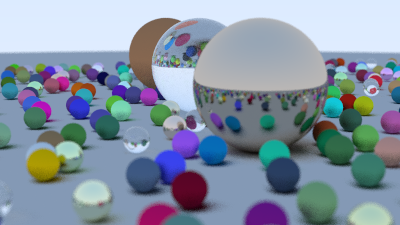

# Weekend Raytracing
An implementation of [*Raytracing in One Weekend* trilogy](https://github.com/RayTracing/raytracing.github.io) in C++ on Visual Studio.



## Features
- [x] Multithreading
- [x] Boundary space partitioning
- [x] Triangle meshes
- [x] Caustics
- [ ] Image textures
- [ ] Hardware acceleration
- [ ] Dense volumes
- [ ] PNG & JPG support

## Running and Building
Use [Visual Studio 2022](https://visualstudio.microsoft.com/)

## Changing Scenes
// TODO: Add command line arguments

For now, find these lines in `main()` in [`main.cpp`](./src/main.cpp)
```cpp
cornell_box_scene masterScene;
HittableList world = masterScene.build();
```

and replace `cornell_box_scene` with the scenes defined in `scene.h`, including
- `tutorial_scene`
- `book_cover_scene`
- `cornell_box_scene`

## License
```
Copyright (c) 2023 Peter Raozen

Permission is hereby granted, free of charge, to any person obtaining a copy
of this software and associated documentation files (the "Software"), to deal
in the Software without restriction, including without limitation the rights
to use, copy, modify, merge, publish, distribute, sublicense, and/or sell
copies of the Software, and to permit persons to whom the Software is
furnished to do so, subject to the following conditions:

The above copyright notice and this permission notice shall be included in all
copies or substantial portions of the Software.

THE SOFTWARE IS PROVIDED "AS IS", WITHOUT WARRANTY OF ANY KIND, EXPRESS OR
IMPLIED, INCLUDING BUT NOT LIMITED TO THE WARRANTIES OF MERCHANTABILITY,
FITNESS FOR A PARTICULAR PURPOSE AND NONINFRINGEMENT. IN NO EVENT SHALL THE
AUTHORS OR COPYRIGHT HOLDERS BE LIABLE FOR ANY CLAIM, DAMAGES OR OTHER
LIABILITY, WHETHER IN AN ACTION OF CONTRACT, TORT OR OTHERWISE, ARISING FROM,
OUT OF OR IN CONNECTION WITH THE SOFTWARE OR THE USE OR OTHER DEALINGS IN THE
SOFTWARE.
```